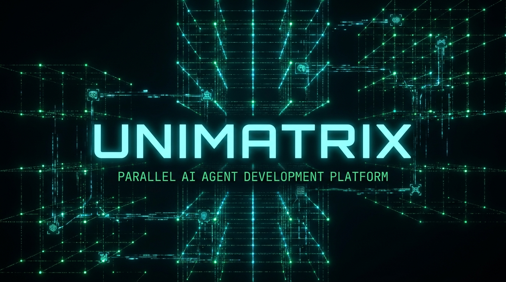
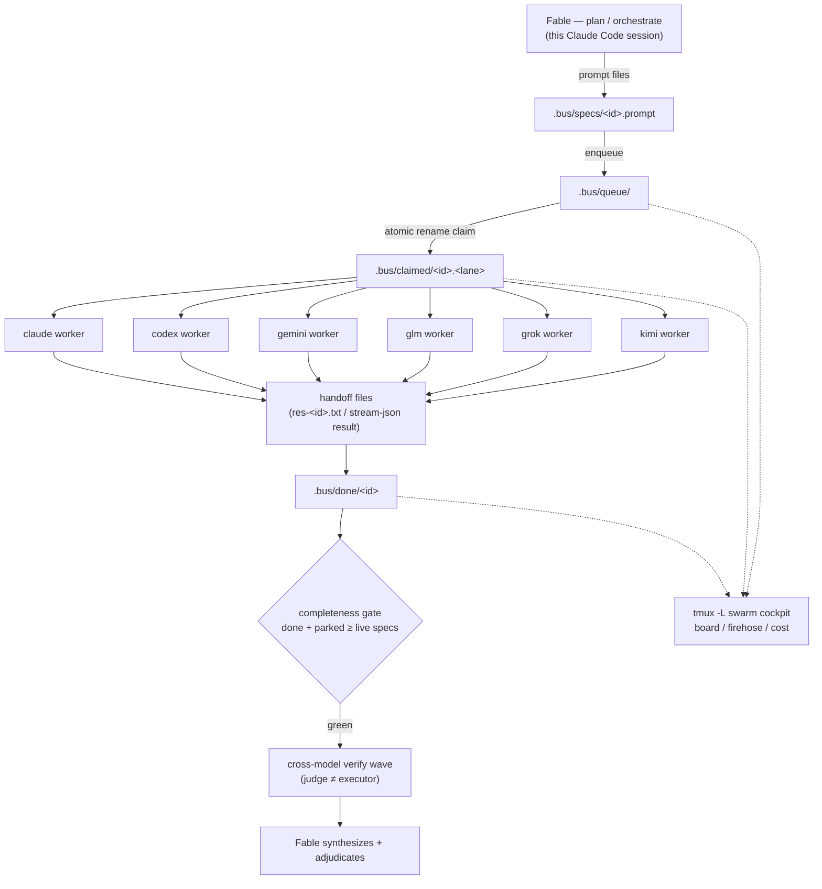

# UNIMATRIX



Fan a question or a goal out to Claude, Codex, Gemini, GLM, Grok, and Kimi in parallel, headless,
coordinated over plain files — no MCP, no daemon, no DB.


## What it does

`/swarm "<question>"` is a Claude Code slash command: the current session (Fable) decomposes the
question into independent branches, writes each as a prompt **file**, and fans them out to headless
worker CLIs — `claude -p`, `codex exec`, `gemini -p`, GLM, Grok, and Kimi. GLM, Grok, and Kimi reuse the
`claude` binary via a child-env swap (GLM → Z.ai, Grok → x.ai, Kimi → Moonshot), so they need no separate CLI.
Workers coordinate over a JSONL file-bus on a local POSIX filesystem: specs move `specs/ → queue/ →
claimed/ → done/` by atomic rename, so claiming is race-free with no daemon and no lock server.
Once every branch lands, a cross-model verify wave checks each answer with a *different* lane than
the one that produced it, and only then does Fable synthesize.

Only two lanes are on by default — `claude` and `codex` (see `EXEC_CHAIN` below). `gemini`, `glm`,
and `grok` are optional extras you opt into once their auth is in place.

`/swarm-loop "<goal>" --until "<criteria>"` is the second mode: instead of one fan-out round, it
writes a success-criteria contract once and iterates — exec, oracle, cross-model review, adjudicate
— until the criteria genuinely hold or a stop rule fires (plateau, oscillation, iteration cap,
budget, wall clock, human abort). It reuses `/swarm`'s bus and pool mechanics rather than inventing
new coordination primitives. The one hard rule in both modes: **judge ≠ executor** — a lane never
grades its own output.

## Architecture



## Quickstart

**Prerequisites**

Linux and macOS are supported natively; on Windows use WSL2 (native Windows / Git Bash is not
supported).

Install the base toolchain — bash ≥5.1, `jq`, `tmux` (for the cockpit); add `bats-core` if you're
developing on this repo:

| Platform | Command |
|----------|---------|
| macOS (Homebrew) | `brew install bash jq tmux` — macOS ships bash 3.2; the `brew` bash ≥5.1 is required, put it ahead of `/bin/bash` on `PATH` |
| Debian / Ubuntu | `sudo apt install bash jq tmux` (add `bats` for the test suite) |
| Fedora / RHEL | `sudo dnf install bash jq tmux bats` |

Worker CLIs (install only the lanes you plan to use — `claude` and `codex` are the default two):

- `claude` (2.1.204+) — `npm i -g @anthropic-ai/claude-code`; auth with `claude login`
  (subscription OAuth). Also powers the GLM and Grok lanes via a child-env swap.
- `codex` (0.143.0+) — `npm i -g @openai/codex`; auth with `codex login --with-api-key`
  (writes `~/.codex/auth.json`).
- `gemini` (0.49.0+, optional) — `npm i -g @google/gemini-cli`; needs `GEMINI_API_KEY`.
- GLM (optional) — no separate CLI; reuses `claude` pointed at Z.ai. Needs a Z.ai coding key.
- Grok (optional) — xAI Grok Build CLI, OAuth file auth (`~/.grok/auth.json`, mode 600).

**Configure**

```bash
cp swarm.conf.example swarm.conf     # role/lane config: PLAN, EXEC_CHAIN, MAX_ITERATIONS, ...
```

The shipped default runs the two always-available lanes:

```bash
EXEC_CHAIN="claude:haiku codex:default"   # left-to-right fallback chain
```

Add `gemini`, `glm:glm-5.2`, or `grok:grok-4.5` to `EXEC_CHAIN` once each lane's auth is set up.

Keys for the env-var lanes (`gemini`, `glm`) are **grepped per-key from an env-master file at spawn
time**, never sourced or read from the ambient shell (workers run under `env -i`). Point
`$ENV_MASTER_FILE` at that file — default
`${XDG_CONFIG_HOME:-$HOME/.config}/unimatrix/env.master`. Put `GEMINI_API_KEY` (gemini) and the
Z.ai coding key (GLM) there. `codex` and `grok` authenticate via their own on-disk files
(`~/.codex/auth.json`, `~/.grok/auth.json`), not env vars.

**Minimal happy path — drive the bus directly**

```bash
mkdir -p .bus/specs
echo "Summarize the tradeoffs of X vs Y in 5 bullets." > .bus/specs/branch-1.prompt

# optional: pin this branch to one lane instead of the EXEC_CHAIN fallback
echo "codex:default" > .bus/specs/branch-1.lane

./swarm-run.sh                        # enqueue + drain the pool, gated on done+parked == live
cat .bus/res-branch-1.txt             # the answer, from the worker's own handoff file

./swarm-run.sh verify                 # cross-model verify wave (judge != executor, VERIFY_MAP)
cat .bus/res-v-branch-1.txt           # the verdict
```

**The `/swarm` route — inside Claude Code**

```
/setup                                # first-time setup helper (auth, config, smoke test)
/swarm "Summarize the tradeoffs of X vs Y"
```
`/setup` walks you through auth and `swarm.conf`. `/swarm` then plans the decomposition in-session,
writes the spec files, and runs the same `swarm-run.sh` / `swarm-run.sh verify` steps above on your
behalf.

**`/swarm-loop` — iterate until criteria hold**

```bash
LOOP_GOAL="tests/foo.bats goes green" LOOP_TIER=1 LOOP_ORACLE="bats tests/foo.bats" \
  LOOP_JUDGE="codex:default" LOOP_HUMAN_GATE=false ./swarm-loop.sh init my-run
./swarm-loop.sh run my-run
```
Exit 0 = goal hit, 2 = halted (see `.bus/loop/my-run/HALTED.md`), 1 = error.

## One CLI, any repo (specs 15-17)

Everything routes through one front door, and the front door travels:

```bash
unimatrix install        # once: PATH symlink, ~/.config/unimatrix/config, plugin enabled everywhere
unimatrix here           # per repo: verify local fs, seed .bus + swarm.conf, register in fleet.json
unimatrix call grok "review this diff" --files changed.txt --write .   # direct single-lane dispatch
unimatrix report --html  # self-contained static speedwars report
unimatrix doctor --plugin  # per-account install-drift table
```

The repo is its own Claude Code plugin marketplace: `/u:call`, `/u:swarm`, `/u:loop`,
`/u:speedwars`, `/u:thrifty`, `/u:readyroom`, `/u:setup` work from **any repo, any account** — generated 3-line pointer stubs
resolve the one engine checkout at invocation time (never a vendored copy; `check.sh` fails on
stub drift). Every run opens with a banner naming exactly which checkout/branch/head/bus it chose,
and closes with a three-line per-lane summary — $ per **verified**-done, p95 wall, false-done
rate — from one canonical verdict-fold both the report and the cockpit replay in tests. Raw run
evidence is archived compressed under `docs/ops/bus-archives/<run>/` at every close.

## Profiles (specs 22-23)

`swarm.conf` stays untouched — a profile is an alternate conf the run selects via `CONF`:

- **Thrifty** (`/u:thrifty`, `profiles/thrifty.conf`) — minimum-Anthropic-spend swarms: codex
  plans and reviews, GLM/Grok execute, the Claude session only orchestrates. The speedwars
  report gains an `anthropic share:` footer so the spend split is verifiable per run.
- **Readyroom** (`/u:readyroom`, `profiles/readyroom.conf`) — deep-research + decision swarm
  modes (`readyroom:research`, `readyroom:decision`, `readyroom:ceo`): GLM/Grok workhorses with
  long-card timeouts, web-capable read-only Grok cards (`GROK_TOOLS`), and one `READYROOM_JUDGE`
  env switch flipping the judge seat between Opus and Codex.

## The cockpit

A read-only `tmux -L swarm` session on its own socket: BOARD (queued/claimed/done/parked, stale
leases, active limit flags), FIREHOSE (`tail -F run-*.jsonl | jq`), and COST — nothing outside its
CONTROL pane ever writes to the bus.

```bash
./swarm-mon.sh                         # bootstrap the cockpit (idempotent)
tmux -L swarm attach -r -t mon         # attach read-only
./swarm-mon.sh --wezterm               # WSL-only convenience: read-only attach from a Windows WezTerm
```

## Design rules that carry it

- Answers come from each worker's own **handoff file** — never scraped from the terminal or
  `run-<id>.jsonl` prose.
- The bus lives on a **local POSIX filesystem** only (never a 9p/drvfs/NFS mount — those break
  `O_APPEND`/`flock`/`inotify`); claiming is an **atomic rename** to a per-worker unique
  destination — a losing claimer's `ENOENT` *is* the lost-race signal.
- **Judge ≠ executor**, always — the verify wave's `VERIFY_MAP` and `/swarm-loop`'s judge lane are
  structurally forced (code-enforced) to differ from the lane that produced the work under review;
  the `REVIEW` role carries the same rule for Fable but as policy, not a runtime check.
- Every spawned run gets a line in the run-evidence ledger (`docs/ops/llm-runs.md`) — no silent
  spend, auto-appended on successful finalize.

## Status and limitations

The full bats suite green, 8 scripts shellcheck-clean, all 6 lanes (claude, codex, gemini, glm,
grok, kimi) live-verified — including loop convergence: a toy repo with a failing oracle driven
to a genuinely green `COMPLETE.md` by a write-capable claude worker in a scratch git worktree
(FR-15). The web-facing gemini lane can run
fully containerized (`GEMINI_SANDBOX=docker`, opt-in — `docker run --rm` with an explicit env
allowlist, zero host mounts, pinned image from `docker/gemini-lane.Dockerfile`); gemini's own
`--sandbox` flag is never used (it re-execs inside Docker and strips the contract env). **Policy:
attended runs by default; an unattended/cron run requires `GEMINI_SANDBOX=docker`.** The gemini
lane is also **not write-capable** in v1 — it's a read-only research/web lane; `claude`, `codex`,
`glm`, and `grok` write only when a branch carries an explicit `.write` sidecar. When the write
target is a git repo, `/swarm-loop` points the writer at a **scratch worktree**, never your working
tree. If the target isn't a git repo, the fallback writes the real tree in place — so that path is
**opt-in** and off by default. For the war stories behind these constraints — live bugs found
building this, corrected protocol designs, model quirks — see
[`docs/02-build-pitfalls.md`](docs/02-build-pitfalls.md).

## Layout

| Path | Purpose |
|------|---------|
| `swarm-run.sh` | `/swarm` driver — enqueue, pool (claim/spawn/finalize), gate, `verify` subcommand, `config` |
| `swarm-loop.sh` | `/swarm-loop` driver — `init` / `iterate` / `run` |
| `swarm-mon.sh` | Read-only tmux cockpit (board/firehose/cost), optional `--wezterm` |
| `src/swarm-ctl` | Bus control verbs: pause/resume/cancel/add/abort/status/kill |
| `src/swarm-lib.sh` | Shared bus primitives: claim, heartbeat, reaper, gate, lane invocations |
| `swarm.conf` | Bash-sourceable role/lane config (`PLAN`, `EXEC_CHAIN`, `MAX_ITERATIONS`, ...) — copy from `swarm.conf.example` |
| `profiles/` | Alternate run configs selected via `CONF`: `thrifty.conf`, `readyroom.conf` + delegated-plan templates |
| `.bus/` | The file-bus: `specs/ queue/ claimed/ done/ limits/ loop/` + per-worker `run-*.jsonl` / `res-*.txt` |
| `.claude/commands/` | `/setup`, `/swarm`, and `/swarm-loop` slash-command definitions |
| `specs/` | Spec-driven design docs — start at [`specs/README.md`](specs/README.md) |
| `rules/unimatrix/` | Project-specific coding rules: bus discipline, model lanes, loop discipline |
| `docs/` | Build history, versions, ops ledger — see [`docs/versions.md`](docs/versions.md), [`docs/lane-economics.md`](docs/lane-economics.md) (which lanes cost real money and why), and [`docs/ops/llm-runs.md`](docs/ops/llm-runs.md) |
| `tests/` | bats-core suite (961 tests) |
| `site/` | Overview page served at [unimatrix.asajj.cz](https://unimatrix.asajj.cz) (Cloudflare Worker, static assets) |

For the full usage guide see `docs/usage.md`; for the design history and the architecture bake-off
that led here, see [`plans/001-multimodel-orchestration/README.md`](plans/001-multimodel-orchestration/README.md).

## License

Licensed under either of Apache-2.0 or MIT at your option.
