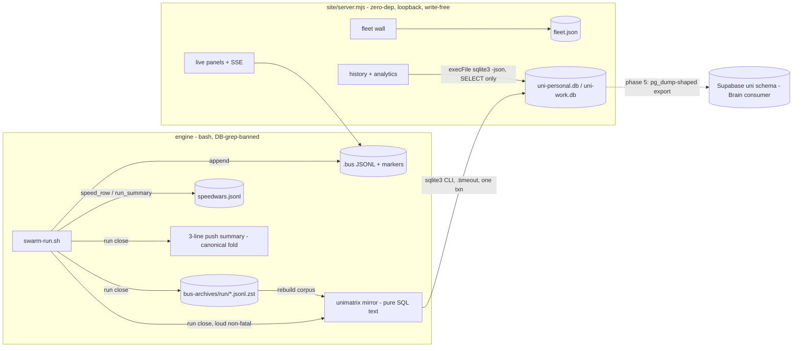
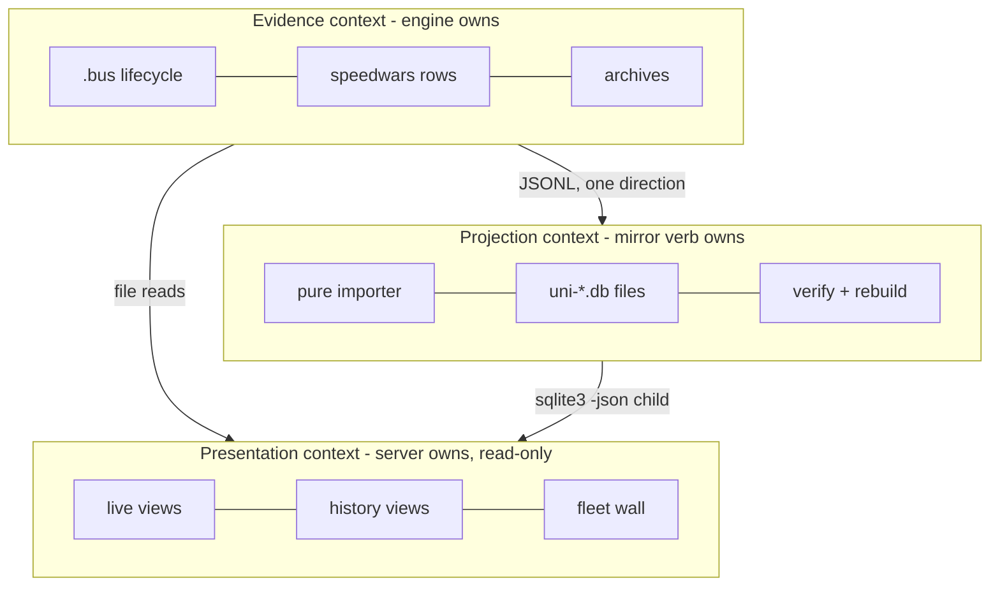
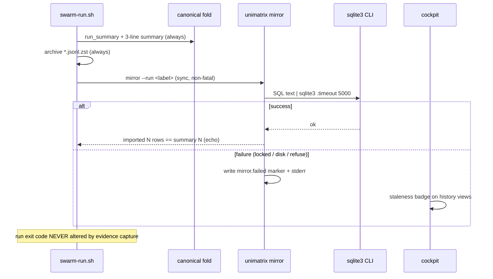
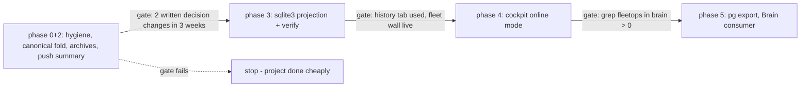

# 00 — SYNTHESIS (architecture decision)

**Question:** how should unimatrix persist run evidence beyond busdir lifetime (mirror engine +
placement), structure the cockpit for multi-bus + history, and package its command surface — with
the file-bus staying the only execution-path truth and the zero-dep offline cockpit an invariant?

**Decision (one line):** honor the phase-2 gate; ship archives + push summary first; when the
gate clears, build the **local SQLite projection applied through the system `sqlite3` CLI**
("C1-amended") — Postgres/Supabase is the deliberate later move *when fleetops exists*, MySQL is
dead, and the plugin ships now regardless (it is orthogonal to storage and already settled).

Status: `draft` — flips to `active` on Robert's acceptance. D1/D2/D3 final calls remain his
(see §Decisions).

---

## Options considered

| | C1 — local SQLite (node:sqlite) | C2 — Postgres/Supabase | C3 — no DB (archives + static) |
|---|---|---|---|
| Shape | JSONL → pure importer → per-domain .db files; cockpit history tab lazy-imports | Same importer → psql client → uni schema in cloud PG; SELECT-only reads | No projection; run-close archives + HTML report + DuckDB ad-hoc |
| Court verdict | Shape survives; **specified implementation does not** (busy_timeout, sync driver, unpinned Node floor, backup) | **Dominated on timing**; right endgame iff fleetops materializes; psql absent = ask-first install today | Discipline + archival adopted; destination rejected (third divergent renderer, correction-blind escape hatch, format bug) |

Full candidates: [03-options.md](./03-options.md). Full court record: [04-steelman.md](./04-steelman.md).

## Decision matrix

Default criteria/weights (METHOD §Scoring), unadjusted — no question-specific reweighting was
justified. Scores are for candidates **as written**; citations = court briefs (04) + evidence pack.

| Criterion | W | C1 | C2 | C3 | Score rationale (compressed) |
|---|---|---|---|---|---|
| Simplicity & operability | 20% | 3.5 | 2.0 | 4.0 | C1: zero install but Node floor + backup discipline + per-domain sprawl (04:C1-pros 1,3,5). C2: cloud, creds, two projects, psql absent (04:C2-pros 1,2,5). C3: least machinery; tar format bug + no retention (04:C3-pros 6,8) |
| Agentic-dev fit | 20% | 4.0 | 3.0 | 3.0 | C1: greppable SQL schema, golden files, boring tech. C2: unrunnable live smoke in gate (#15 skip-rot). C3: correction-blind ad-hoc is an agent trap (04:C3-pros 7) |
| Domain fit (DDD) | 15% | 4.0 | 4.0 | 3.0 | C1/C2 identical clean Evidence/Projection/Presentation contexts (04:C2-pros concession). C3: fold invariant duplicated across renderers = spec 09 FR-2 violation |
| Evolution & headroom | 15% | 4.5 | 3.5 | 3.5 | C1: engine-portable, archives as corpus, exit ≈ 0. C2: best endgame, absent counterparty. C3: "deferred infra doesn't get built here" (04:C3-pros 9) discounts the promise |
| Testability (TDD) | 10% | 4.5 | 2.5 | 4.0 | C1: pure importer + local smoke anywhere. C2: live assertion structurally outside gate forever. C3: pure renderer golden files |
| Delivery speed | 10% | 3.5 | 2.5 | 4.5 | 2-4d + hardening / 2-4d + creds + install / 1-2d |
| Cost | 5% | 4.0 | 3.0 | 4.5 | attention cost dominates at this scale |
| Risk & reversibility | 5% | 4.0 | 2.5 | 3.5 | C1: drop the .db. C2: cred blast radius (#12). C3: prompt-bearing tarballs unexamined (04:C3-pros 10) |
| **Weighted** | | **3.98** | **2.90** | **3.63** | |

**Sensitivity check:** swapping any adjacent weight pair ±5pp (Simplicity↔Domain, Agentic↔Evolution,
Testability↔Delivery) moves totals ≤0.05 and never flips C1 > C3 > C2. The winner is robust; no
prose tiebreaker needed.

**Deviation from the as-scored winner (argued, per method):** the recommendation is not C1 as
written but **C1-amended** — every amendment adopts a prosecution finding and strictly increases
C1's winning criteria scores; nothing in the amendments reintroduces a C2/C3 property the court
rejected.

## The recommendation, precisely

**Phase 0 (now, no gate):** hygiene from the PRD (run-key `_run_label()`, skill symlinks, path
resolution, banners, check.sh greps) **plus the court-discovered fold defect**: one canonical
verdict-fold semantic (join key + unjudged-card handling), `src/speedwars-report.sh` as the
canonical push implementation, `site/cockpit/speed.js` aligned, and a shared fixture asserting
both produce identical numbers.

**Phase 2 (now, no gate):** 3-line push close-out summary (from the canonical fold); run-close
evidence archival as **`docs/ops/bus-archives/<run>/*.jsonl.zst`** — globbable per pre-mortem
#20's actual prescription, NOT tarballs; archives carry prompt text → documented as
operator-local, gitignored, never shipped (spec 08's zero-prompt-text rule governs the DB only).
`unimatrix report [--html]` shells the canonical fold — never re-derives. **Gate:** 3 weeks +
≥2 decisions changed, written down.

**Phase 3 (post-gate):** the projection —
- **Apply via the system `sqlite3` CLI** (present; pin a row in docs/versions.md + doctor check).
  Importer = pure bash function emitting SQL text (golden-file bats tests, zero DB in check.sh);
  application = `sqlite3` with `.timeout 5000`, single transaction. node:sqlite is not used
  anywhere — no Node floor, no RC-stability exposure.
- **Loud non-fatal import:** never a bare `|| true` — failure writes `mirror.failed` marker
  (cockpit badge) + stderr line; success echoes imported-row count vs run_summary count
  (automatic completeness check); `mirror --verify` re-derives aggregates vs the canonical fold,
  non-empty diff = hard failure.
- Per-domain files (`uni-personal.db` / `uni-work.db`) chosen from `busdir_realpath`, hard
  refuse on mismatch; documented `ATTACH` one-liner for deliberate cross-domain queries.
- DB holds zero original data — rebuild = delete + re-import from archives; the **archives are
  the backup target**, never the .db (no live-file `cp` — corruption class).
- Server reads history via execFile'd `sqlite3 -json` (same delegation pattern as swarm-ctl;
  event loop never blocks; server keeps zero DB code, zero write capability).

**Phase 4:** cockpit — fleet wall (fleet.json registry), history tab (mirror-backed), analytics
+ operator inbox; staleness badge + "derived from … up to …" footer on every mirror view;
scrubbed-env bats asserts the zero-dep offline path forever; loopback bind hard-coded.

**Phase 5 (activation: fleetops accepts the published contract):** enable `mirror --push` —
the same emitted SQL applied via `psql` (`CREATE SCHEMA uni`, direct connection, single txn,
loud non-fatal like the local import) to the domain-matched Postgres: work-domain runs → the
Brain-side instance only, personal-domain → personal Supabase only, same `busdir_realpath` hard
refuse. Consumer code lives in Brain. The push applier + golden-file tests ship EARLIER (with
the contract, ungated); only live pushing waits. This is where C2 becomes right.

**Plugin (orthogonal, ships in phase 1 regardless):** in-repo `.claude-plugin/` + directory-
sourced self-marketplace; generated `commands/`; `unimatrix install` across all 11 settings
files; `doctor --plugin` drift table. Cache-copy semantics make the generated-build + drift
table mandatory (official docs finding).

## Decisions — TAKEN (2026-07-25, Robert delegated the call; veto reopens)

New ground truth from Robert: **fleetops is committed** — it will be built, online, in the
Brain monorepo (work side). That shifts timing and contract ownership, not the architecture (the
court's C2 prosecution pre-answered this branch: "if fleetops materializes and Brain is the
consumer, C2 is straightforwardly simpler *then*").

- **D0 repo location (new): unimatrix stays OUTSIDE the monorepo — sender model.** Personal
  cross-repo tool (work/personal boundary at repo scale); plugin must install from any checkout
  without a Brain clone; bash/bats stack is alien to Brain CI; severability is load-bearing.
  The connection is a versioned contract, not co-location: unimatrix = producer, fleetops =
  consumer.
- **D1 engine: BOTH, sequenced.** One pure SQL-text emitter, two appliers. `sqlite3` applies
  locally = the live store (offline-complete, zero-dep, gated per D2). `mirror --push` applies
  the same text via `psql` to the domain-matched Postgres — **spec'd + golden-file tested from
  day one, dormant until fleetops accepts the contract** (no pushes into a consumer-less schema:
  that is an active credential surface with no reader). MySQL: never (zero presence, no consumer).
- **D1b contract-first (replaces "wait for grep"):** unimatrix publishes
  `sql/uni-schema.sql` (engine-portable DDL) + `docs/fleetops-contract.md` (join keys:
  session_id, statusline marker, orchestrating account, PK `(host, busdir_realpath, run, id, ts)`;
  correction-fold semantics; staleness/watermark fields) as a **phase-2/3 deliverable, ungated** —
  Brain builds fleetops against the producer's contract, schema churn stays with the producer.
  Phase-5 activation trigger becomes "fleetops accepts the contract", not "grep > 0".
- **D2 gate: honored** — governs the local reporting UI (phase 3-4 build). Contract work is
  explicitly outside the gate (cheap, pure-text, unblocks Brain in parallel).
- **D3 marketplace: directory-sourced now**, GitHub-sourced at first stable plugin release.

Dossier status flips `draft` → `active` on these decisions.

## Risk register (winner's prosecution → mitigation, per method)

| # | Risk (from C1 prosecution) | Mitigation in the amended design |
|---|---|---|
| 1 | Silent import loss (`\|\| true` + busy default) | sqlite3 CLI `.timeout` + loud non-fatal marker + automatic row-count completeness + verify diff = hard fail |
| 2 | History query blocks live event loop | execFile'd `sqlite3 -json` child — server never opens the DB in-process |
| 3 | Unpinned runtime floor | node:sqlite eliminated; `sqlite3` pinned in docs/versions.md + doctor |
| 4 | Unbacked evidence on WSL2 (#20) | DB = cache, archives = record; back up `bus-archives/` (operator action — named, not assumed); monthly rebuild drill |
| 5 | Per-domain split deletes cross-domain query | documented ATTACH helper; boundary hard-refuse stays |
| 6 | Pull surface nobody reads (#16) | the gate itself — phase 3 does not start without two written decision changes |
| 7 | Accepted residual | work/personal boundary remains a path convention (mechanism deferred to `~/.config/unimatrix/config` prefix list); fold drift can re-emerge in future views — fixture test is the tripwire |

## Diagrams

### Container (recommended end-state, phases 2+3+4)

### Boundary map

### Critical sequence — run close with import failure (highest-risk flow)

### Evolution path

## First TDD steps (red first, house flow)

1. `tests/swarm-lib.bats`: fixture JSONL → `_run_label()` red tests (identical label from
   speed_row/run_summary/feedback_stub paths).
2. `tests/speedwars-fold.bats` (new): one fixture ledger with a false-done verdict → assert
   `speedwars-report.sh` and the `/api/speedwars`-fed fold produce byte-identical `$per
   verified-done` — red against today's divergence.
3. `tests/swarm-run.bats`: run close writes `bus-archives/<run>/speedwars.jsonl.zst` +
   `run-*.jsonl.zst`; summary lines printed; rc unaffected.
4. (post-gate) `tests/uni-mirror.bats` (new): golden-file SQL text from fixture rows; completeness
   echo; `mirror.failed` marker on induced failure; boundary hard-refuse fixture.

## Assumptions register

- "MySQL" in the ask was shorthand for "online SQL reporting", not a hard engine constraint —
  **unconfirmed; D1 is the confirmation**.
- Robert (or a routine) will actually back up `docs/ops/bus-archives/` once named the backup
  target — named as an operator action in the risk register, not assumed silently.
- Supabase direct-connect availability from this host (phase 5 only) — unverified, flagged in
  evidence pack.
- Phase-2 gate honesty: "a decision changed because of the summary" will be written down when it
  happens — the gate is self-reported.
