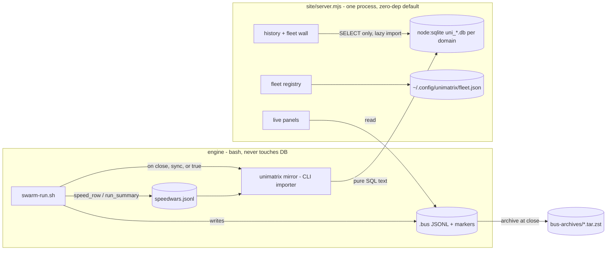
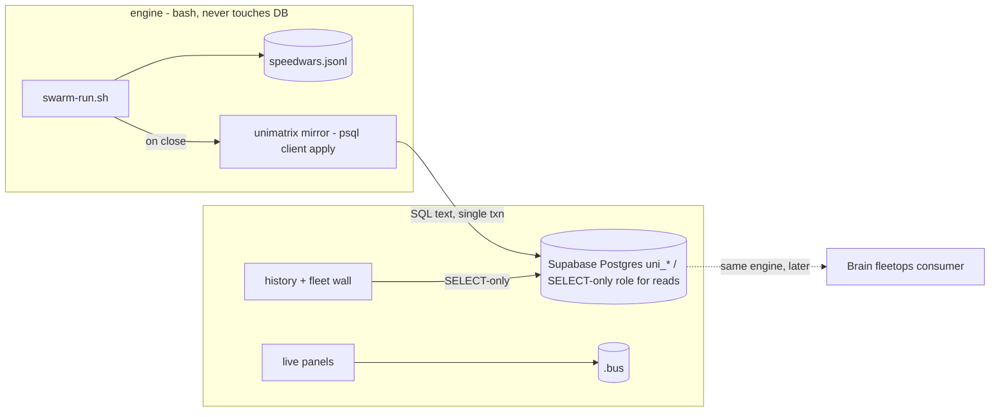
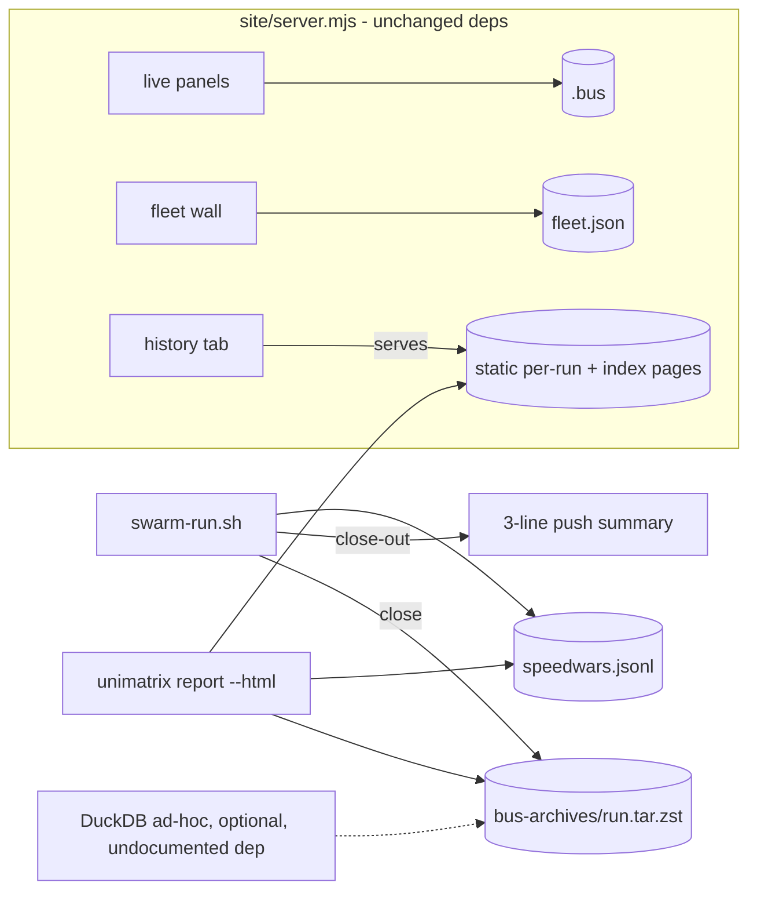

# 03 — Architecture candidates

Three genuinely different shapes. Shared settled points (from synthesis.md, not re-litigated
here): plugin ships commands + skill with the engine staying a `$UNIMATRIX_HOME` checkout;
importer (where one exists) is a pure JSONL→SQL projection, no daemon, engine scripts never touch
a DB; zero-dep offline cockpit path is an invariant; fleetops = emit an artifact, no integration.

The open axes the candidates actually differ on: **mirror engine + placement**, **cockpit process
topology**, **how much gets built before the phase-2 usefulness gate**.

---

## C1 — "Local history": node:sqlite file + one server (synthesis lean)

One SQLite file per ownership domain (`~/.local/share/unimatrix/uni-personal.db`,
`uni-work.db` — split chosen from `busdir_realpath` at import, hard refuse on mismatch).
Importer = `unimatrix mirror` CLI verb calling a pure `jsonl→SQL` function; invoked synchronously
at run close (`|| true`) and via `mirror --since` catch-up. Cockpit: the existing single server
grows a fleet-wall + history tab; DB access via `await import('node:sqlite')` behind
`UNI_DB_PATH` — absent DB, absent tab, everything else unchanged.

- **DDD boundaries:** Evidence (JSONL, owned by engine) / Projection (uni_*.db, owned by mirror
  verb) / Presentation (server, read-only both sides). The bus context never learns SQL exists.
- **Test seams:** importer is a pure function — golden-file SQL text tests, zero DB in check.sh;
  one `node:sqlite` smoke behind an env flag; server offline-path bats (scrubbed env → 200s).
- **Evolution path:** schema is engine-portable (3 tables, JSON payload) → `pg_dump`-shaped
  export to Supabase/Brain when fleetops materializes; SQLite file simply becomes the local cache.
  Exit cost: near zero (drop the .db, JSONL remains truth).
- **Rough cost:** ~2-4 days. New deps: none (node:sqlite is builtin ≥22; verify version gate).
- **Main risk:** Node version gate on `node:sqlite`; a second storage engine to explain even if
  tiny; constitution says Postgres-first — this deviates and must justify it with the zero-infra
  evidence.

## C2 — "Postgres-first": uni_* in existing Supabase, psql-client export (constitution default)

No new engine family: the `uni_*` tables land in an existing Supabase Postgres (personal project;
a separate schema/database on the work side for work runs — same split rule). Export =
`unimatrix mirror` emitting SQL applied via the `psql` client (`--single-transaction`), creds
grepped least-privilege from `~/s/.env.master` at call time, never in conf/argv. Cockpit history
tab reads through a SELECT-only role; live panels unchanged. Brain join later is same-engine,
same-instance-family — the fleetops artifact IS a table Brain can already reach.

- **DDD boundaries:** identical to C1; only the Projection context's storage moves off-box.
- **Test seams:** identical golden-file importer tests (SQL text is engine-portable); live smoke
  needs network + creds → strictly outside check.sh.
- **Evolution path:** the strongest — fleetops consumer is a `CREATE VIEW` away; Supabase handles
  backup/durability. Exit cost: `DROP SCHEMA`, JSONL remains truth.
- **Rough cost:** ~2-4 days + credential wiring + pooler quirks for tiny batch inserts.
- **Main risks:** reporting now depends on network + a cloud service for a local tool ("cockpit
  history offline on a train" fails); work/personal split now spans two cloud projects — a
  mis-route leaks repo metadata across the boundary (pre-mortem #12) with worse blast radius than
  a local file; latency/pooler friction for `mirror --since` backfills; the daily-use offline
  invariant now has a second-class sibling.

## C3 — "Do less": no database — archives + static report (defer SQL past the gate)

Take pre-mortem #16 at full strength: build NO storage engine until the phase-2 gate proves
reporting changes decisions. Run close: (a) 3-line push summary printed from JSONL; (b) bus
archived `bus-archives/<run>.tar.zst` + the run's speedwars slice, making every panel's raw
inputs durable; (c) `unimatrix report --html` renders a self-contained static page per run (and a
cross-run index) from JSONL alone. Fleet wall still ships (it reads live buses via fleet.json —
no DB involved). Ad-hoc analytics = optional DuckDB `read_json_auto` over the archives, a
documented one-liner, not shipped code.

- **DDD boundaries:** no Projection context at all — Evidence + Presentation only.
- **Test seams:** report renderer is pure (JSONL in → HTML out) — golden-file HTML fragments;
  archive round-trip test (tar → extract → identical panels).
- **Evolution path:** if the gate passes, C1 or C2 is built LATER on top of the archives —
  which by then are the complete rebuild corpus (pre-mortem #20 solved as a side effect). Exit
  cost: zero; nothing to un-build.
- **Rough cost:** ~1-2 days. New deps: zstd (already ubiquitous) — effectively none.
- **Main risks:** cross-run queries stay jq-grade until a DB exists (the "which lane is cheapest
  for C2 cards" question is a script, not a query); two renderers (live cockpit + static report)
  can drift; if the gate passes anyway, total cost = C3 + C1/C2 (though the archive work is
  shared, not wasted).

---

## Rejected shapes (named so they stay rejected)

- **Importer inside server.mjs** — trades the server's write-free property for convenience
  (pre-mortem #13). Rejected regardless of winner.
- **Standing sync daemon** — pre-mortem #3; on-close + catch-up covers the need.
- **MySQL** — zero MySQL anywhere in the environment (discovery §5); would be a new engine family
  with no precedent, no backup story, and no consumer. Only revives if an external MySQL
  constraint surfaces (D1 remains Robert's call).
- **Vendoring the engine into the plugin** — two copies of 5.4k lines of bash; drift guaranteed
  (brainstorm #5 vs #4).
